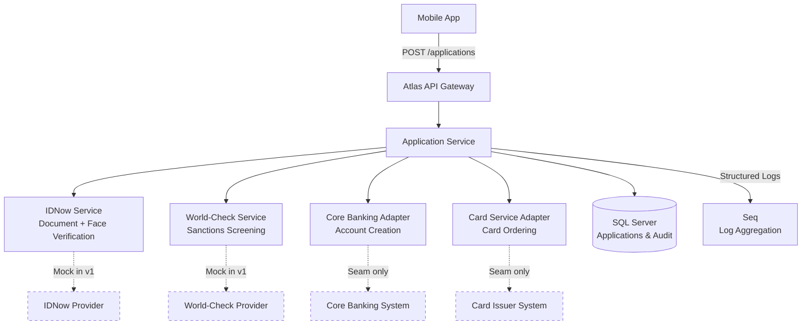
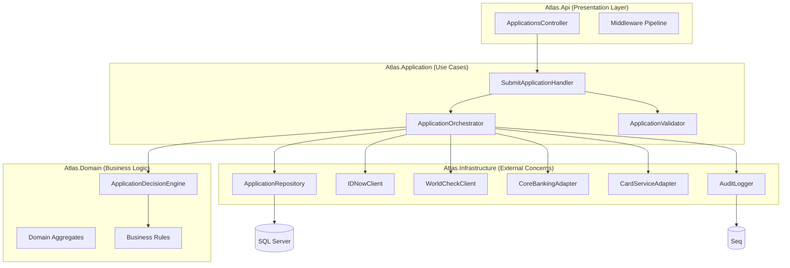
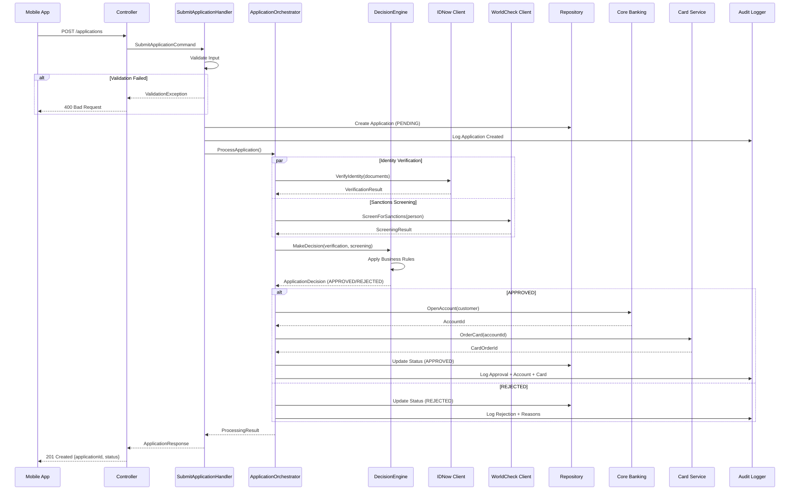

# Design Document: Atlas Onboarding Backend System

## Overview

Atlas is a digital customer onboarding platform for a banking group operating in six markets (MA-MF). The system processes customer applications through identity verification and sanctions screening to deliver fully automated account opening and card ordering within 3 minutes. This design implements a synchronous, fully automated flow (Phase 1/v1) with architecture prepared for future async manual review workflows.

**Core Design Principles:**
- **Single Codebase, Multi-Market:** Configuration-driven market differences, no code forks
- **Designed for Upgrade:** PENDING_REVIEW status exists but unused in v1; architecture supports future manual review workflow
- **Clean Architecture:** Domain-driven design with clear separation between decision logic and execution logic
- **Testability First:** Mock-friendly external integrations, property-based testing for business rules
- **Compliance by Design:** Audit logging, data sovereignty patterns, 10-year retention strategy

**Phase 1 Trade-off:** POSSIBLE_MATCH sanctions results are auto-rejected in v1 to meet the "3 minutes, fully automated" product requirement. This conflicts with the compliance preference for manual review but aligns with the acceptance criteria (AC2, AC3). Architecture supports upgrade to async review workflow when business prioritizes compliance over speed.

---

## Architecture

### System Context



### Service Architecture

**Single Service Design Decision:** For a 3-day assessment demonstrating architectural thinking, a well-structured modular monolith with clear internal boundaries is more valuable than multiple services with inter-service communication complexity. The internal architecture uses ports/adapters pattern to enable future service extraction.



### Application Flow (Sequence Diagram)



---

## Components and Interfaces

### Component 1: Application Service (Use Case Layer)

**Purpose:** Orchestrates the onboarding workflow, coordinating verification, screening, decision-making, and downstream actions.

**Interface:**
```csharp
public interface IApplicationOrchestrator
{
    Task<ApplicationResult> ProcessApplicationAsync(
        Application application, 
        CancellationToken cancellationToken);
}

public record ApplicationResult(
    Guid ApplicationId,
    ApplicationStatus Status,
    string? RejectionReason,
    Guid? AccountId,
    Guid? CardOrderId);

public enum ApplicationStatus
{
    Pending,
    Approved,
    Rejected,
    PendingReview  // Unused in v1, reserved for future manual review workflow
}
```

**Responsibilities:**
- Coordinate parallel execution of identity verification and sanctions screening
- Invoke decision engine to evaluate results against business rules
- Execute downstream actions (account opening, card ordering) for approved applications
- Persist application state transitions with full audit trail
- Handle transient failures with retry policies
- Ensure idempotency of external operations

**Implementation Pattern:** Command Handler with orchestration logic, using Task.WhenAll for parallel provider calls.

---

### Component 2: Decision Engine (Domain Layer)

**Purpose:** Encapsulates all business rules for application approval/rejection decisions. Pure domain logic with no external dependencies.

**Interface:**
```csharp
public interface IApplicationDecisionEngine
{
    ApplicationDecision MakeDecision(
        IdentityVerificationResult identityResult,
        SanctionsScreeningResult sanctionsResult,
        MarketConfiguration marketConfig);
}

public record ApplicationDecision(
    ApplicationStatus Status,
    IReadOnlyList<RejectionReason> Reasons)
{
    public bool IsApproved => Status == ApplicationStatus.Approved;
    public bool IsRejected => Status == ApplicationStatus.Rejected;
}

public enum RejectionReason
{
    InvalidDocument,
    FaceMismatch,
    Inconclusive VerificationResult,
    SanctionMatch,
    PossibleSanctionMatch,  // Auto-reject in v1
    VerificationProviderUnavailable,
    ScreeningProviderUnavailable,
    MarketSpecificRuleFailed
}
```

**Responsibilities:**
- Apply decision rules based on verification and screening results
- Enforce market-specific business rules (e.g., Market MD branch activation requirement)
- Determine approval/rejection with explicit reasons
- **V1 Rule:** POSSIBLE_MATCH sanctions result → REJECTED (documented as temporary trade-off)
- Maintain decision logic testability (pure functions, no side effects)

**Business Rules (v1):**
1. **Approval Criteria:** `documentResult == VALID AND faceMatch == true AND sanctionsStatus == CLEAR`
2. **Auto-Rejection Scenarios:**
   - Invalid or inconclusive document verification
   - Face match failure
   - Clear sanctions/PEP match
   - **POSSIBLE_MATCH sanctions result** (v1 pragmatic decision)
   - Provider unavailability after retries
3. **Market-Specific Rules:** Applied as additional validation (e.g., MD market metadata tagging)

---

### Component 3: Identity Verification Service

**Purpose:** Abstracts IDNow integration for document authenticity and face matching.

**Interface:**
```csharp
public interface IIdentityVerificationService
{
    Task<IdentityVerificationResult> VerifyIdentityAsync(
        IdentityVerificationRequest request,
        CancellationToken cancellationToken);
}

public record IdentityVerificationRequest(
    DocumentType DocumentType,
    string DocumentImageBase64,
    string SelfieImageBase64);

public record IdentityVerificationResult(
    string ProviderId,
    DocumentVerificationStatus DocumentStatus,
    bool FaceMatch,
    decimal Confidence,
    DateTime VerifiedAt);

public enum DocumentVerificationStatus
{
    Valid,
    Invalid,
    Inconclusive
}
```

**Responsibilities:**
- Transform domain request to IDNow API format
- Execute HTTP call with timeout and retry policies (Polly: 3 retries, exponential backoff)
- Map provider response to domain result model
- Handle provider-specific errors gracefully
- Log provider interactions for audit trail

**Mock Implementation (v1):**
```csharp
public class MockIdentityVerificationService : IIdentityVerificationService
{
    // Configuration-driven scenarios for testing:
    // - Happy path: VALID + faceMatch=true
    // - Document rejection: INVALID
    // - Face mismatch: VALID + faceMatch=false
    // - Inconclusive: INCONCLUSIVE status
    // - Timeout/unavailable scenarios
}
```

---

### Component 4: Sanctions Screening Service

**Purpose:** Abstracts World-Check integration for sanctions and PEP screening.

**Interface:**
```csharp
public interface ISanctionsScreeningService
{
    Task<SanctionsScreeningResult> ScreenAsync(
        SanctionsScreeningRequest request,
        CancellationToken cancellationToken);
}

public record SanctionsScreeningRequest(
    string FirstName,
    string LastName,
    DateOnly DateOfBirth,
    string Nationality);

public record SanctionsScreeningResult(
    string CaseId,
    ScreeningStatus Status,
    IReadOnlyList<SanctionMatch> Matches,
    DateTime ScreenedAt);

public enum ScreeningStatus
{
    Clear,
    PossibleMatch  // Auto-rejected in v1, but architecture supports future review workflow
}

public record SanctionMatch(
    MatchType Type,
    decimal Score,
    string Subject);

public enum MatchType
{
    Sanctions,
    PEP
}
```

**Responsibilities:**
- Transform domain request to World-Check API format
- Execute screening with retry policies
- Map provider response to domain model
- Handle POSSIBLE_MATCH results (returns to orchestrator for decision engine evaluation)
- Log screening interactions for compliance audit

**Mock Implementation (v1):**
```csharp
public class MockSanctionsScreeningService : ISanctionsScreeningService
{
    // Configuration-driven scenarios:
    // - Clear: Status.Clear with empty matches
    // - PossibleMatch: Status.PossibleMatch with sample matches
    // - Sanctions hit: Status.PossibleMatch with Sanctions match
    // - PEP hit: Status.PossibleMatch with PEP match
}
```

---

### Component 5: Application Validator

**Purpose:** Validates incoming application requests against market-specific rules before processing.

**Interface:**
```csharp
public interface IApplicationValidator
{
    ValidationResult Validate(SubmitApplicationCommand command);
}

public record ValidationResult(
    bool IsValid,
    IReadOnlyList<ValidationError> Errors);

public record ValidationError(
    string Field,
    string Code,
    string Message);
```

**Responsibilities:**
- Validate required fields (name, DOB, nationalId, email, phone, market, documents)
- Validate market code against supported markets (MA-MF)
- Validate national ID format using market-specific patterns (from Annex B)
- Validate document types (PASSPORT or ID_CARD required, SELFIE required)
- Validate base64 image data integrity
- Validate email and phone format
- Enforce termsAccepted == true

**Market-Specific Validation (National ID Formats):**
```csharp
public interface INationalIdValidator
{
    bool IsValid(string nationalId, string marketCode);
}

// Configuration from Annex B:
// MA: Format pattern A
// MB: Format pattern B
// MC: Format pattern C
// MD: Format pattern D
// ME: Format pattern E
// MF: Format pattern F
```

---

### Component 6: Core Banking Adapter

**Purpose:** Seam for account opening in core banking system.

**Interface:**
```csharp
public interface ICoreBank ingService
{
    Task<AccountCreationResult> OpenAccountAsync(
        AccountCreationRequest request,
        CancellationToken cancellationToken);
}

public record AccountCreationRequest(
    Guid ApplicationId,
    string FirstName,
    string LastName,
    DateOnly DateOfBirth,
    string NationalId,
    string Email,
    string Phone,
    string MarketCode);

public record AccountCreationResult(
    Guid AccountId,
    string AccountNumber,
    DateTime CreatedAt);
```

**Responsibilities:**
- Provide clean abstraction for account opening
- Handle idempotency (ApplicationId as idempotency key)
- Log account creation for audit
- **V1 Implementation:** Simple mock that generates AccountId and AccountNumber

---

### Component 7: Card Service Adapter

**Purpose:** Seam for card ordering system.

**Interface:**
```csharp
public interface ICardOrderingService
{
    Task<CardOrderResult> OrderCardAsync(
        CardOrderRequest request,
        CancellationToken cancellationToken);
}

public record CardOrderRequest(
    Guid AccountId,
    string FirstName,
    string LastName,
    string DeliveryAddress);

public record CardOrderResult(
    Guid CardOrderId,
    string CardReference,
    DateTime OrderedAt);
```

**Responsibilities:**
- Provide clean abstraction for card ordering
- Handle idempotency (AccountId as idempotency key)
- Log card order for audit
- **V1 Implementation:** Simple mock that generates CardOrderId
- **MD Market Special Case:** Document that cards ordered for MD market require branch activation (metadata flag)

---

### Component 8: Audit Logger

**Purpose:** Comprehensive audit logging for compliance and troubleshooting.

**Interface:**
```csharp
public interface IAuditLogger
{
    void LogApplicationCreated(Guid applicationId, string marketCode, string userId);
    void LogVerificationCompleted(Guid applicationId, IdentityVerificationResult result);
    void LogScreeningCompleted(Guid applicationId, SanctionsScreeningResult result);
    void LogDecisionMade(Guid applicationId, ApplicationDecision decision);
    void LogAccountOpened(Guid applicationId, Guid accountId);
    void LogCardOrdered(Guid applicationId, Guid cardOrderId);
    void LogApplicationStatusChanged(Guid applicationId, ApplicationStatus from, ApplicationStatus to, string reason);
    void LogDataAccess(string userId, string resourceType, string resourceId, string action);
}
```

**Responsibilities:**
- Structured logging to Seq with correlation IDs
- Log who accessed what data when (compliance requirement)
- Log all state transitions with reasons
- Log all external provider interactions
- Enable 10-year retention through log export/archival strategy
- Support data sovereignty by including market code in all logs

**Implementation:** Uses Serilog with enrichers for correlation, user context, and market context.

---

## Data Models

### Domain Model: Application Aggregate

```csharp
public class Application
{
    public Guid Id { get; private set; }
    public string FirstName { get; private set; }
    public string LastName { get; private set; }
    public DateOnly DateOfBirth { get; private set; }
    public string MarketCode { get; private set; }
    public string NationalId { get; private set; }
    public string Email { get; private set; }
    public string Phone { get; private set; }
    public ApplicationStatus Status { get; private set; }
    public DateTime CreatedAt { get; private set; }
    public DateTime? CompletedAt { get; private set; }
    
    // Related entities
    public IReadOnlyList<Document> Documents { get; private set; }
    public IdentityVerification? IdentityVerification { get; private set; }
    public SanctionsScreening? SanctionsScreening { get; private set; }
    public AccountDetails? AccountDetails { get; private set; }
    public CardOrder? CardOrder { get; private set; }
    
    // Value objects
    public ApplicationDecision? Decision { get; private set; }
    
    // Business methods
    public void StartVerification() { /* ... */ }
    public void CompleteVerification(IdentityVerificationResult result) { /* ... */ }
    public void CompleteScreening(SanctionsScreeningResult result) { /* ... */ }
    public void Approve(Guid accountId, Guid cardOrderId) { /* ... */ }
    public void Reject(IReadOnlyList<RejectionReason> reasons) { /* ... */ }
}
```

**Validation Rules:**
- FirstName, LastName: Required, 1-100 characters, UTF-8 support for international names
- DateOfBirth: Required, must be 18+ years old
- MarketCode: Required, must be in {MA, MB, MC, MD, ME, MF}
- NationalId: Required, must match market-specific format
- Email: Required, valid email format
- Phone: Required, E.164 format recommended
- Documents: At least 2 required (1 ID document + 1 selfie)
- Status: Immutable state transitions (Pending → Approved/Rejected, no reversals)

---

### Database Schema

```sql
-- Applications table
CREATE TABLE Applications (
    Id UNIQUEIDENTIFIER PRIMARY KEY DEFAULT NEWID(),
    FirstName NVARCHAR(100) NOT NULL,
    LastName NVARCHAR(100) NOT NULL,
    DateOfBirth DATE NOT NULL,
    MarketCode NVARCHAR(2) NOT NULL,
    NationalId NVARCHAR(50) NOT NULL,
    Email NVARCHAR(255) NOT NULL,
    Phone NVARCHAR(20) NOT NULL,
    Status NVARCHAR(20) NOT NULL, -- Pending, Approved, Rejected, PendingReview
    CreatedAt DATETIME2 NOT NULL DEFAULT SYSUTCDATETIME(),
    CompletedAt DATETIME2 NULL,
    
    -- Audit fields
    CreatedBy NVARCHAR(100) NULL,
    
    CONSTRAINT CK_Applications_Status CHECK (Status IN ('Pending', 'Approved', 'Rejected', 'PendingReview')),
    CONSTRAINT CK_Applications_MarketCode CHECK (MarketCode IN ('MA', 'MB', 'MC', 'MD', 'ME', 'MF'))
);

CREATE INDEX IX_Applications_MarketCode_Status ON Applications(MarketCode, Status);
CREATE INDEX IX_Applications_CreatedAt ON Applications(CreatedAt);
CREATE INDEX IX_Applications_Email ON Applications(Email);

-- Documents table
CREATE TABLE Documents (
    Id UNIQUEIDENTIFIER PRIMARY KEY DEFAULT NEWID(),
    ApplicationId UNIQUEIDENTIFIER NOT NULL,
    DocumentType NVARCHAR(20) NOT NULL, -- PASSPORT, ID_CARD, SELFIE
    ImageData VARBINARY(MAX) NOT NULL, -- Base64 decoded for efficiency
    UploadedAt DATETIME2 NOT NULL DEFAULT SYSUTCDATETIME(),
    
    CONSTRAINT FK_Documents_Application FOREIGN KEY (ApplicationId) REFERENCES Applications(Id),
    CONSTRAINT CK_Documents_Type CHECK (DocumentType IN ('PASSPORT', 'ID_CARD', 'SELFIE'))
);

CREATE INDEX IX_Documents_ApplicationId ON Documents(ApplicationId);

-- Identity Verifications table
CREATE TABLE IdentityVerifications (
    Id UNIQUEIDENTIFIER PRIMARY KEY DEFAULT NEWID(),
    ApplicationId UNIQUEIDENTIFIER NOT NULL UNIQUE,
    ProviderId NVARCHAR(100) NOT NULL, -- IDNow identification ID
    DocumentStatus NVARCHAR(20) NOT NULL, -- Valid, Invalid, Inconclusive
    FaceMatch BIT NOT NULL,
    Confidence DECIMAL(5,4) NOT NULL,
    VerifiedAt DATETIME2 NOT NULL,
    
    CONSTRAINT FK_IdentityVerifications_Application FOREIGN KEY (ApplicationId) REFERENCES Applications(Id),
    CONSTRAINT CK_IdentityVerifications_DocumentStatus CHECK (DocumentStatus IN ('Valid', 'Invalid', 'Inconclusive'))
);

-- Sanctions Screenings table
CREATE TABLE SanctionsScreenings (
    Id UNIQUEIDENTIFIER PRIMARY KEY DEFAULT NEWID(),
    ApplicationId UNIQUEIDENTIFIER NOT NULL UNIQUE,
    CaseId NVARCHAR(100) NOT NULL, -- World-Check case ID
    Status NVARCHAR(20) NOT NULL, -- Clear, PossibleMatch
    ScreenedAt DATETIME2 NOT NULL,
    
    CONSTRAINT FK_SanctionsScreenings_Application FOREIGN KEY (ApplicationId) REFERENCES Applications(Id),
    CONSTRAINT CK_SanctionsScreenings_Status CHECK (Status IN ('Clear', 'PossibleMatch'))
);

-- Sanction Matches table (if PossibleMatch)
CREATE TABLE SanctionMatches (
    Id UNIQUEIDENTIFIER PRIMARY KEY DEFAULT NEWID(),
    ScreeningId UNIQUEIDENTIFIER NOT NULL,
    MatchType NVARCHAR(20) NOT NULL, -- Sanctions, PEP
    Score DECIMAL(5,4) NOT NULL,
    Subject NVARCHAR(500) NOT NULL,
    
    CONSTRAINT FK_SanctionMatches_Screening FOREIGN KEY (ScreeningId) REFERENCES SanctionsScreenings(Id),
    CONSTRAINT CK_SanctionMatches_Type CHECK (MatchType IN ('Sanctions', 'PEP'))
);

-- Account Details table
CREATE TABLE AccountDetails (
    Id UNIQUEIDENTIFIER PRIMARY KEY DEFAULT NEWID(),
    ApplicationId UNIQUEIDENTIFIER NOT NULL UNIQUE,
    AccountId UNIQUEIDENTIFIER NOT NULL,
    AccountNumber NVARCHAR(50) NOT NULL,
    CreatedAt DATETIME2 NOT NULL,
    
    CONSTRAINT FK_AccountDetails_Application FOREIGN KEY (ApplicationId) REFERENCES Applications(Id)
);

-- Card Orders table
CREATE TABLE CardOrders (
    Id UNIQUEIDENTIFIER PRIMARY KEY DEFAULT NEWID(),
    ApplicationId UNIQUEIDENTIFIER NOT NULL UNIQUE,
    AccountId UNIQUEIDENTIFIER NOT NULL,
    CardOrderId UNIQUEIDENTIFIER NOT NULL,
    CardReference NVARCHAR(50) NOT NULL,
    RequiresBranchActivation BIT NOT NULL DEFAULT 0, -- True for MD market
    OrderedAt DATETIME2 NOT NULL,
    
    CONSTRAINT FK_CardOrders_Application FOREIGN KEY (ApplicationId) REFERENCES Applications(Id)
);

-- Application Decisions table (decision reasons)
CREATE TABLE ApplicationDecisions (
    Id UNIQUEIDENTIFIER PRIMARY KEY DEFAULT NEWID(),
    ApplicationId UNIQUEIDENTIFIER NOT NULL UNIQUE,
    Status NVARCHAR(20) NOT NULL,
    DecidedAt DATETIME2 NOT NULL,
    
    CONSTRAINT FK_ApplicationDecisions_Application FOREIGN KEY (ApplicationId) REFERENCES Applications(Id)
);

-- Rejection Reasons table
CREATE TABLE RejectionReasons (
    Id UNIQUEIDENTIFIER PRIMARY KEY DEFAULT NEWID(),
    DecisionId UNIQUEIDENTIFIER NOT NULL,
    Reason NVARCHAR(50) NOT NULL,
    
    CONSTRAINT FK_RejectionReasons_Decision FOREIGN KEY (DecisionId) REFERENCES ApplicationDecisions(Id)
);

-- Audit Log table (alternative to Seq for 10-year retention)
CREATE TABLE AuditLogs (
    Id UNIQUEIDENTIFIER PRIMARY KEY DEFAULT NEWID(),
    Timestamp DATETIME2 NOT NULL DEFAULT SYSUTCDATETIME(),
    UserId NVARCHAR(100) NULL,
    ApplicationId UNIQUEIDENTIFIER NULL,
    MarketCode NVARCHAR(2) NULL,
    EventType NVARCHAR(50) NOT NULL,
    ResourceType NVARCHAR(50) NULL,
    ResourceId NVARCHAR(100) NULL,
    Action NVARCHAR(50) NULL,
    Details NVARCHAR(MAX) NULL, -- JSON
    
    CONSTRAINT FK_AuditLogs_Application FOREIGN KEY (ApplicationId) REFERENCES Applications(Id)
);

CREATE INDEX IX_AuditLogs_Timestamp ON AuditLogs(Timestamp);
CREATE INDEX IX_AuditLogs_ApplicationId ON AuditLogs(ApplicationId);
CREATE INDEX IX_AuditLogs_UserId ON AuditLogs(UserId);
CREATE INDEX IX_AuditLogs_MarketCode ON AuditLogs(MarketCode);
```

**Data Sovereignty Strategy:**
- Market code indexed on all tables for efficient market-specific queries
- Audit logs include market code for compliance filtering
- Design supports future physical data segregation per market (separate databases or schemas)
- Current approach: logical segregation via market code column

**10-Year Retention Strategy:**
- Seq for operational logs (30-90 days retention)
- AuditLogs table for long-term compliance (10 years)
- Periodic archival job to move old data to cold storage
- Applications table never purged (compliance requirement)

---

## Market Configuration

### Configuration Model

```csharp
public record MarketConfiguration(
    string MarketCode,
    string CountryName,
    NationalIdValidationRule NationalIdRule,
    bool RequiresBranchActivation,
    bool IsActive);

public record NationalIdValidationRule(
    string Pattern,
    string Description,
    string Example);
```

### Configuration Source: appsettings.json

```json
{
  "Markets": {
    "MA": {
      "CountryName": "Market A",
      "NationalIdPattern": "^\\d{10}$",
      "NationalIdDescription": "10 digits",
      "NationalIdExample": "1234567890",
      "RequiresBranchActivation": false,
      "IsActive": true
    },
    "MB": {
      "CountryName": "Market B",
      "NationalIdPattern": "^\\d{13}$",
      "NationalIdDescription": "13 digits (YYMMDDGSSSSCC)",
      "NationalIdExample": "9103042345678",
      "RequiresBranchActivation": false,
      "IsActive": true
    },
    "MC": {
      "CountryName": "Market C",
      "NationalIdPattern": "^[A-Z]{2}\\d{6}$",
      "NationalIdDescription": "2 letters + 6 digits",
      "NationalIdExample": "AB123456",
      "RequiresBranchActivation": false,
      "IsActive": true
    },
    "MD": {
      "CountryName": "Market D",
      "NationalIdPattern": "^\\d{9}$",
      "NationalIdDescription": "9 digits",
      "NationalIdExample": "123456789",
      "RequiresBranchActivation": true,
      "IsActive": true
    },
    "ME": {
      "CountryName": "Market E",
      "NationalIdPattern": "^\\d{11}$",
      "NationalIdDescription": "11 digits",
      "NationalIdExample": "12345678901",
      "RequiresBranchActivation": false,
      "IsActive": true
    },
    "MF": {
      "CountryName": "Market F",
      "NationalIdPattern": "^[A-Z]\\d{7}$",
      "NationalIdDescription": "1 letter + 7 digits",
      "NationalIdExample": "A1234567",
      "RequiresBranchActivation": false,
      "IsActive": true
    }
  }
}
```

**Design Rationale:**
- Configuration file over database: Easier to version control, deploy, and test
- Market-specific rules externalized from code
- Easy to add new markets without code changes
- Validation patterns from Annex B encoded as regex
- Branch activation flag for MD market special case

---

## API Contracts

### POST /applications

**Request:**
```json
{
  "firstName": "Alice",
  "lastName": "Johnson",
  "dateOfBirth": "1991-03-04",
  "country": "MB",
  "nationalId": "9103042345678",
  "email": "alice.johnson@example.com",
  "phone": "+27821234567",
  "documents": [
    {
      "type": "PASSPORT",
      "image": "<base64-encoded-image>"
    },
    {
      "type": "SELFIE",
      "image": "<base64-encoded-image>"
    }
  ],
  "termsAccepted": true
}
```

**Response (Approved):**
```json
{
  "applicationId": "3fa85f64-5717-4562-b3fc-2c963f66afa6",
  "status": "APPROVED"
}
```
**Status Code:** 201 Created  
**Location Header:** `/applications/3fa85f64-5717-4562-b3fc-2c963f66afa6`

**Response (Rejected):**
```json
{
  "applicationId": "3fa85f64-5717-4562-b3fc-2c963f66afa6",
  "status": "REJECTED"
}
```
**Status Code:** 201 Created  
**Note:** Still returns 201 because the application resource was created, even though it was rejected.

**Error Responses:**

**400 Bad Request (Validation Error):**
```json
{
  "type": "https://tools.ietf.org/html/rfc9110#section-15.5.1",
  "title": "One or more validation errors occurred.",
  "status": 400,
  "errors": {
    "NationalId": ["National ID format is invalid for market MB. Expected format: 13 digits (YYMMDDGSSSSCC)"],
    "Documents": ["At least one identity document (PASSPORT or ID_CARD) and one SELFIE are required"]
  }
}
```

**500 Internal Server Error:**
```json
{
  "type": "https://tools.ietf.org/html/rfc9110#section-15.6.1",
  "title": "An error occurred while processing your request.",
  "status": 500,
  "traceId": "00-a1b2c3d4e5f6-a1b2c3d4e5f6-01"
}
```

---

### GET /applications/{id}

**Purpose:** Retrieve application status. Built in v1 to demonstrate forward-thinking architecture (supports future async workflow where status changes over time).

**Request:**
```
GET /applications/3fa85f64-5717-4562-b3fc-2c963f66afa6
```

**Response (Approved):**
```json
{
  "applicationId": "3fa85f64-5717-4562-b3fc-2c963f66afa6",
  "status": "APPROVED",
  "firstName": "Alice",
  "lastName": "Johnson",
  "country": "MB",
  "createdAt": "2026-09-15T10:30:00Z",
  "completedAt": "2026-09-15T10:32:45Z",
  "accountId": "a1b2c3d4-e5f6-7890-abcd-ef1234567890"
}
```
**Status Code:** 200 OK

**Response (Rejected):**
```json
{
  "applicationId": "3fa85f64-5717-4562-b3fc-2c963f66afa6",
  "status": "REJECTED",
  "firstName": "Alice",
  "lastName": "Johnson",
  "country": "MB",
  "createdAt": "2026-09-15T10:30:00Z",
  "completedAt": "2026-09-15T10:32:45Z",
  "rejectionReasons": ["FaceMismatch"]
}
```
**Status Code:** 200 OK

**Response (Not Found):**
```json
{
  "type": "https://tools.ietf.org/html/rfc9110#section-15.5.5",
  "title": "Application not found.",
  "status": 404
}
```
**Status Code:** 404 Not Found

---

## Key Algorithms and Business Logic

### Algorithm 1: Application Processing Workflow

```csharp
public async Task<ApplicationResult> ProcessApplicationAsync(
    Application application,
    CancellationToken cancellationToken)
{
    // Preconditions:
    // - application is valid and persisted with Status = Pending
    // - application.Documents contains at least 1 ID document and 1 selfie
    // - cancellationToken is valid
    
    try
    {
        // Step 1: Parallel external provider calls
        var verificationTask = _identityVerificationService.VerifyIdentityAsync(
            new IdentityVerificationRequest(
                GetDocumentType(application.Documents),
                GetDocumentImage(application.Documents),
                GetSelfieImage(application.Documents)),
            cancellationToken);
        
        var screeningTask = _sanctionsScreeningService.ScreenAsync(
            new SanctionsScreeningRequest(
                application.FirstName,
                application.LastName,
                application.DateOfBirth,
                application.MarketCode),
            cancellationToken);
        
        // Wait for both to complete (Task.WhenAll ensures parallel execution)
        await Task.WhenAll(verificationTask, screeningTask);
        
        var verificationResult = await verificationTask;
        var screeningResult = await screeningTask;
        
        // Step 2: Log verification and screening results
        _auditLogger.LogVerificationCompleted(application.Id, verificationResult);
        _auditLogger.LogScreeningCompleted(application.Id, screeningResult);
        
        // Step 3: Persist verification and screening data
        application.CompleteVerification(verificationResult);
        application.CompleteScreening(screeningResult);
        await _repository.UpdateAsync(application);
        
        // Step 4: Make decision based on results
        var marketConfig = _marketConfigurationProvider.GetMarketConfiguration(application.MarketCode);
        var decision = _decisionEngine.MakeDecision(verificationResult, screeningResult, marketConfig);
        
        _auditLogger.LogDecisionMade(application.Id, decision);
        
        // Step 5: Execute downstream actions based on decision
        if (decision.IsApproved)
        {
            // Open account
            var accountResult = await _coreBankingService.OpenAccountAsync(
                new AccountCreationRequest(
                    application.Id,
                    application.FirstName,
                    application.LastName,
                    application.DateOfBirth,
                    application.NationalId,
                    application.Email,
                    application.Phone,
                    application.MarketCode),
                cancellationToken);
            
            _auditLogger.LogAccountOpened(application.Id, accountResult.AccountId);
            
            // Order card
            var cardResult = await _cardOrderingService.OrderCardAsync(
                new CardOrderRequest(
                    accountResult.AccountId,
                    application.FirstName,
                    application.LastName,
                    DeliveryAddress: ""), // TODO: Capture address in future version
                cancellationToken);
            
            _auditLogger.LogCardOrdered(application.Id, cardResult.CardOrderId);
            
            // Update application to approved
            application.Approve(accountResult.AccountId, cardResult.CardOrderId);
            await _repository.UpdateAsync(application);
            
            return new ApplicationResult(
                application.Id,
                ApplicationStatus.Approved,
                RejectionReason: null,
                accountResult.AccountId,
                cardResult.CardOrderId);
        }
        else
        {
            // Reject application
            application.Reject(decision.Reasons);
            await _repository.UpdateAsync(application);
            
            return new ApplicationResult(
                application.Id,
                ApplicationStatus.Rejected,
                string.Join(", ", decision.Reasons),
                AccountId: null,
                CardOrderId: null);
        }
    }
    catch (Exception ex)
    {
        // Log error and mark application as rejected due to technical failure
        _logger.LogError(ex, "Failed to process application {ApplicationId}", application.Id);
        
        application.Reject(new[] { RejectionReason.VerificationProviderUnavailable });
        await _repository.UpdateAsync(application);
        
        throw; // Re-throw to return 500 to client
    }
    
    // Postconditions:
    // - Application status is either Approved or Rejected
    // - All state transitions are persisted to database
    // - All actions are logged to audit trail
    // - If Approved: AccountId and CardOrderId are set
    // - If Rejected: RejectionReasons are documented
}
```

**Preconditions:**
- `application` is valid and persisted with `Status = Pending`
- `application.Documents` contains at least 1 ID document and 1 selfie
- All external services are available (or have retry policies configured)
- `cancellationToken` is valid

**Postconditions:**
- Application status is either `Approved` or `Rejected`
- All state transitions are persisted to database
- All actions are logged to audit trail with timestamps
- If `Approved`: `AccountId` and `CardOrderId` are set and non-null
- If `Rejected`: `RejectionReasons` list is populated with at least one reason
- Verification and screening results are persisted regardless of outcome

**Loop Invariants:** N/A (no loops in this algorithm)

**Error Handling:**
- Transient provider failures: Retry via Polly policies (3 attempts, exponential backoff)
- Persistent provider failures: Log error, reject application with specific reason
- Database failures: Bubble up exception, return 500 to client
- Cancellation: Respect cancellation token, perform cleanup

---

### Algorithm 2: Application Decision Logic

```csharp
public ApplicationDecision MakeDecision(
    IdentityVerificationResult identityResult,
    SanctionsScreeningResult sanctionsResult,
    MarketConfiguration marketConfig)
{
    // Preconditions:
    // - identityResult is not null and contains valid verification data
    // - sanctionsResult is not null and contains valid screening data
    // - marketConfig is not null and corresponds to a valid market
    
    var rejectionReasons = new List<RejectionReason>();
    
    // Rule 1: Document must be VALID
    if (identityResult.DocumentStatus != DocumentVerificationStatus.Valid)
    {
        rejectionReasons.Add(
            identityResult.DocumentStatus == DocumentVerificationStatus.Invalid
                ? RejectionReason.InvalidDocument
                : RejectionReason.InconclusiveVerificationResult);
    }
    
    // Rule 2: Face must match
    if (!identityResult.FaceMatch)
    {
        rejectionReasons.Add(RejectionReason.FaceMismatch);
    }
    
    // Rule 3: Sanctions screening must be CLEAR
    // V1 DECISION: POSSIBLE_MATCH is auto-rejected to meet "3 minutes, fully automated" requirement
    // Future: This becomes PendingReview status when manual review workflow is implemented
    if (sanctionsResult.Status != ScreeningStatus.Clear)
    {
        // Check if there are high-confidence matches (sanctions vs PEP)
        var hasSanctionsMatch = sanctionsResult.Matches.Any(m => 
            m.Type == MatchType.Sanctions && m.Score >= 0.8m);
        
        if (hasSanctionsMatch)
        {
            rejectionReasons.Add(RejectionReason.SanctionMatch);
        }
        else
        {
            // POSSIBLE_MATCH without clear sanctions hit
            rejectionReasons.Add(RejectionReason.PossibleSanctionMatch);
        }
    }
    
    // Rule 4: Apply market-specific rules if needed
    // Currently no additional market-specific rejection rules beyond validation
    // MD market special case (branch activation) is handled post-approval, not in decision logic
    
    // Determine final status
    var status = rejectionReasons.Any() 
        ? ApplicationStatus.Rejected 
        : ApplicationStatus.Approved;
    
    return new ApplicationDecision(status, rejectionReasons.AsReadOnly());
    
    // Postconditions:
    // - Decision status is either Approved or Rejected (never PendingReview in v1)
    // - If Rejected: rejectionReasons contains at least one reason
    // - If Approved: rejectionReasons is empty
    // - Decision is deterministic (same inputs always produce same output)
}
```

**Preconditions:**
- `identityResult` is not null and contains valid verification data
- `sanctionsResult` is not null and contains valid screening data
- `marketConfig` is not null and corresponds to a valid market (MA-MF)

**Postconditions:**
- Decision status is either `Approved` or `Rejected` (never `PendingReview` in v1)
- If `Rejected`: `rejectionReasons` contains at least one reason
- If `Approved`: `rejectionReasons` is empty
- Decision is **deterministic**: same inputs always produce same output (no side effects, pure function)

**Loop Invariants:**
- For sanctions match iteration: All previously checked matches remain valid
- Match evaluation is idempotent

**Business Rules Summary:**
1. **Approval**: `DocumentStatus == VALID AND FaceMatch == true AND ScreeningStatus == CLEAR`
2. **Rejection**: Any of the following:
   - Invalid or inconclusive document
   - Face mismatch
   - POSSIBLE_MATCH sanctions result (v1 pragmatic decision)
   - Clear sanctions/PEP match with high confidence score

---

### Algorithm 3: National ID Validation

```csharp
public bool IsValid(string nationalId, string marketCode)
{
    // Preconditions:
    // - nationalId is not null or empty
    // - marketCode is valid (MA-MF)
    
    if (string.IsNullOrWhiteSpace(nationalId))
    {
        return false;
    }
    
    var marketConfig = _marketConfigurationProvider.GetMarketConfiguration(marketCode);
    if (marketConfig == null || !marketConfig.IsActive)
    {
        return false;
    }
    
    // Apply market-specific regex pattern from configuration
    var regex = new Regex(marketConfig.NationalIdRule.Pattern, RegexOptions.Compiled);
    var isMatch = regex.IsMatch(nationalId);
    
    return isMatch;
    
    // Postconditions:
    // - Returns true if and only if nationalId matches market-specific pattern
    // - No side effects
}
```

**Preconditions:**
- `nationalId` is not null
- `marketCode` is valid (MA-MF)

**Postconditions:**
- Returns `true` if and only if `nationalId` matches market-specific regex pattern
- Returns `false` for null/empty nationalId or invalid market code
- No side effects (pure function)

**Loop Invariants:** N/A (no loops)

---

## Example Usage

### Example 1: Successful Application (Happy Path)

```csharp
// Arrange
var command = new SubmitApplicationCommand(
    FirstName: "Alice",
    LastName: "Johnson",
    DateOfBirth: new DateOnly(1991, 3, 4),
    Country: "MB",
    NationalId: "9103042345678",
    Email: "alice.johnson@example.com",
    Phone: "+27821234567",
    Documents: new List<DocumentDto>
    {
        new(Type: "PASSPORT", Image: "<base64-passport-image>"),
        new(Type: "SELFIE", Image: "<base64-selfie-image>")
    },
    TermsAccepted: true);

// Act
var response = await _handler.Handle(command, CancellationToken.None);

// Assert - Application is approved
Assert.Equal(ApplicationStatus.Approved, response.Status);
Assert.NotNull(response.ApplicationId);
Assert.NotNull(response.AccountId);
Assert.NotNull(response.CardOrderId);

// Verify downstream actions
var application = await _repository.GetByIdAsync(response.ApplicationId);
Assert.Equal(ApplicationStatus.Approved, application.Status);
Assert.NotNull(application.AccountDetails);
Assert.NotNull(application.CardOrder);
```

### Example 2: Rejected Application (Face Mismatch)

```csharp
// Arrange - Mock IDNow to return face mismatch
_mockIdentityService
    .Setup(x => x.VerifyIdentityAsync(It.IsAny<IdentityVerificationRequest>(), It.IsAny<CancellationToken>()))
    .ReturnsAsync(new IdentityVerificationResult(
        ProviderId: "idn_test_123",
        DocumentStatus: DocumentVerificationStatus.Valid,
        FaceMatch: false, // Face mismatch
        Confidence: 0.45m,
        VerifiedAt: DateTime.UtcNow));

var command = new SubmitApplicationCommand(/* ... */);

// Act
var response = await _handler.Handle(command, CancellationToken.None);

// Assert - Application is rejected
Assert.Equal(ApplicationStatus.Rejected, response.Status);
Assert.Contains("FaceMismatch", response.RejectionReason);
Assert.Null(response.AccountId);
Assert.Null(response.CardOrderId);
```

### Example 3: Rejected Application (POSSIBLE_MATCH Sanctions)

```csharp
// Arrange - Mock World-Check to return POSSIBLE_MATCH
_mockSanctionsService
    .Setup(x => x.ScreenAsync(It.IsAny<SanctionsScreeningRequest>(), It.IsAny<CancellationToken>()))
    .ReturnsAsync(new SanctionsScreeningResult(
        CaseId: "wc_test_456",
        Status: ScreeningStatus.PossibleMatch,
        Matches: new List<SanctionMatch>
        {
            new(Type: MatchType.PEP, Score: 0.82m, Subject: "Alice Johnson - Former Minister")
        }.AsReadOnly(),
        ScreenedAt: DateTime.UtcNow));

var command = new SubmitApplicationCommand(/* ... */);

// Act
var response = await _handler.Handle(command, CancellationToken.None);

// Assert - Application is rejected (v1 behavior)
Assert.Equal(ApplicationStatus.Rejected, response.Status);
Assert.Contains("PossibleSanctionMatch", response.RejectionReason);

// Note: In future v2 with manual review, this would return:
// Assert.Equal(ApplicationStatus.PendingReview, response.Status);
```

### Example 4: Validation Error (Invalid National ID)

```csharp
// Arrange - Invalid national ID for market MB
var command = new SubmitApplicationCommand(
    FirstName: "Alice",
    LastName: "Johnson",
    DateOfBirth: new DateOnly(1991, 3, 4),
    Country: "MB",
    NationalId: "123", // Invalid: should be 13 digits
    Email: "alice.johnson@example.com",
    Phone: "+27821234567",
    Documents: new List<DocumentDto> { /* ... */ },
    TermsAccepted: true);

// Act & Assert
var exception = await Assert.ThrowsAsync<ValidationException>(() => 
    _handler.Handle(command, CancellationToken.None));

Assert.Contains("National ID format is invalid", exception.Message);
Assert.Contains("Expected format: 13 digits", exception.Message);
```

### Example 5: GET /applications/{id}

```csharp
// Arrange - Application exists in database
var applicationId = Guid.Parse("3fa85f64-5717-4562-b3fc-2c963f66afa6");
var existingApplication = new Application(/* ... */);
existingApplication.Approve(accountId: Guid.NewGuid(), cardOrderId: Guid.NewGuid());
await _repository.AddAsync(existingApplication);

// Act
var response = await _client.GetAsync($"/applications/{applicationId}");

// Assert
response.EnsureSuccessStatusCode();
var result = await response.Content.ReadFromJsonAsync<ApplicationResponse>();
Assert.Equal(ApplicationStatus.Approved, result.Status);
Assert.NotNull(result.AccountId);
```

---

## Correctness Properties

*A property is a characteristic or behavior that should hold true across all valid executions of a system—essentially, a formal statement about what the system should do. Properties serve as the bridge between human-readable specifications and machine-verifiable correctness guarantees.*

### Property 1: Application Status Transitions

*For any* application with status Pending, processing SHALL transition the status to either Approved or Rejected, and the application SHALL NOT remain in Pending state after processing completes.

**Validates: Requirements 5.4, 5.5, 8.2**

**Universal Quantification:**
```
∀ application ∈ Applications:
  application.Status = Pending →
    (application.Status' = Approved ∨ application.Status' = Rejected) ∧
    (application.Status' ≠ Pending)

Where:
  application.Status' represents the status after ProcessApplicationAsync completes
  No application remains in Pending state after processing
  State transitions are irreversible (no Approved → Rejected or vice versa)
```

**Test Implementation:**
```csharp
[Property]
public Property Application_MustTransitionFromPending(Application application)
{
    Prop.ForAll(
        Arb.From<Application>().Where(a => a.Status == ApplicationStatus.Pending),
        async app =>
        {
            var result = await _orchestrator.ProcessApplicationAsync(app, CancellationToken.None);
            
            return result.Status != ApplicationStatus.Pending &&
                   (result.Status == ApplicationStatus.Approved || result.Status == ApplicationStatus.Rejected);
        });
}
```

---

### Property 2: Approval Implies Downstream Actions Completed

*For any* approved application, both account details and card order SHALL be created and persisted with valid identifiers.

**Validates: Requirements 6.1, 6.2, 7.1, 7.2**

**Universal Quantification:**
```
∀ application ∈ Applications:
  application.Status = Approved →
    (application.AccountDetails ≠ null ∧ application.CardOrder ≠ null)

Where:
  Every approved application has both account and card order created
  No approved application has null AccountDetails or null CardOrder
```

**Test Implementation:**
```csharp
[Property]
public Property ApprovedApplication_MustHaveAccountAndCard()
{
    Prop.ForAll(
        Arb.From<Application>().Where(a => a.Status == ApplicationStatus.Approved),
        app =>
        {
            return app.AccountDetails != null &&
                   app.CardOrder != null &&
                   app.AccountDetails.AccountId != Guid.Empty &&
                   app.CardOrder.CardOrderId != Guid.Empty;
        });
}
```

---

### Property 3: Rejection Implies At Least One Reason

*For any* rejected application, at least one rejection reason SHALL be documented and persisted.

**Validates: Requirements 5.7, 12.9**

**Universal Quantification:**
```
∀ application ∈ Applications:
  application.Status = Rejected →
    (application.Decision ≠ null ∧ |application.Decision.Reasons| ≥ 1)

Where:
  Every rejected application has at least one documented rejection reason
  No rejected application has empty or null reasons list
```

**Test Implementation:**
```csharp
[Property]
public Property RejectedApplication_MustHaveReasons()
{
    Prop.ForAll(
        Arb.From<Application>().Where(a => a.Status == ApplicationStatus.Rejected),
        app =>
        {
            return app.Decision != null &&
                   app.Decision.Reasons.Count >= 1;
        });
}
```

---

### Property 4: Decision Determinism

*For any* combination of identity verification result, sanctions screening result, and market configuration, the decision engine SHALL produce identical results when invoked multiple times with the same inputs.

**Validates: Requirement 5.6**

**Universal Quantification:**
```
∀ (verificationResult, screeningResult, marketConfig):
  MakeDecision(verificationResult, screeningResult, marketConfig) =
  MakeDecision(verificationResult, screeningResult, marketConfig)

Where:
  Decision function is pure (no side effects)
  Same inputs always produce identical outputs
  No dependency on time, random numbers, or external state
```

**Test Implementation:**
```csharp
[Property]
public Property Decision_IsDeterministic(
    IdentityVerificationResult verification,
    SanctionsScreeningResult screening,
    MarketConfiguration market)
{
    var decision1 = _decisionEngine.MakeDecision(verification, screening, market);
    var decision2 = _decisionEngine.MakeDecision(verification, screening, market);
    
    return decision1.Status == decision2.Status &&
           decision1.Reasons.SequenceEqual(decision2.Reasons);
}
```

---

### Property 5: National ID Validation is Idempotent

*For any* national ID and market code combination, the validation function SHALL return the same result when called multiple times with identical inputs.

**Validates: Requirements 2.1, 2.2, 2.3, 2.4, 2.5, 2.6**

**Universal Quantification:**
```
∀ (nationalId, marketCode):
  IsValid(nationalId, marketCode) = IsValid(nationalId, marketCode)

Where:
  Validation function is idempotent
  Multiple calls with same inputs produce same result
  No side effects on validation state
```

**Test Implementation:**
```csharp
[Property]
public Property NationalIdValidation_IsIdempotent(string nationalId, string marketCode)
{
    Prop.ForAll(
        Arb.From<string>(),
        Arb.From<string>().Where(m => new[] { "MA", "MB", "MC", "MD", "ME", "MF" }.Contains(m)),
        (id, market) =>
        {
            var result1 = _validator.IsValid(id, market);
            var result2 = _validator.IsValid(id, market);
            
            return result1 == result2;
        });
}
```

---

### Property 6: All Applications Must Be Audit Logged

*For any* application created in the system, at least one audit log entry SHALL exist with the ApplicationCreated event type.

**Validates: Requirements 10.1, 10.9**

**Universal Quantification:**
```
∀ application ∈ Applications:
  ∃ auditLog ∈ AuditLogs:
    auditLog.ApplicationId = application.Id ∧
    auditLog.EventType = "ApplicationCreated"

Where:
  Every application has at least one corresponding audit log entry
  Audit trail is complete for all applications
```

**Test Implementation:**
```csharp
[Property]
public async Task<Property> Application_MustHaveAuditLog(Application application)
{
    await _repository.AddAsync(application);
    
    var auditLogs = await _auditRepository.GetByApplicationIdAsync(application.Id);
    
    return auditLogs.Any(log => 
        log.ApplicationId == application.Id &&
        log.EventType == "ApplicationCreated");
}
```

---

### Property 7: Approval Criteria Satisfaction

*For any* application where identity verification returns Valid document AND face match is true AND sanctions screening returns Clear status, the Decision_Engine SHALL approve the application.

**Validates: Requirements 3.3, 4.3, 5.1**

**Universal Quantification:**
```
∀ application ∈ Applications:
  (verificationResult.DocumentStatus = Valid ∧
   verificationResult.FaceMatch = true ∧
   screeningResult.Status = Clear) →
   decision.Status = Approved
```

**Test Implementation:**
```csharp
[Property]
public Property ApprovalCriteriaSatisfaction_ApprovesApplication()
{
    Prop.ForAll(
        GenerateValidVerification(),
        GenerateClearScreening(),
        (verification, screening) =>
        {
            var decision = _decisionEngine.MakeDecision(verification, screening, _marketConfig);
            return decision.IsApproved;
        });
}
```

---

### Property 8: Rejection for Invalid Verification

*For any* application where identity verification returns Invalid or Inconclusive document status OR face match is false, the Decision_Engine SHALL reject the application.

**Validates: Requirements 3.4, 3.5, 5.2**

**Universal Quantification:**
```
∀ application ∈ Applications:
  (verificationResult.DocumentStatus ∈ {Invalid, Inconclusive} ∨
   verificationResult.FaceMatch = false) →
   decision.Status = Rejected
```

**Test Implementation:**
```csharp
[Property]
public Property InvalidVerification_RejectsApplication()
{
    Prop.ForAll(
        GenerateInvalidOrInconclusiveVerification(),
        verification =>
        {
            var screening = GenerateClearScreening();
            var decision = _decisionEngine.MakeDecision(verification, screening, _marketConfig);
            return decision.IsRejected;
        });
}
```

---

### Property 9: V1 Auto-Rejection for PossibleMatch

*For any* application in version 1 where sanctions screening returns PossibleMatch status, the Decision_Engine SHALL reject the application.

**Validates: Requirements 4.4, 19.2**

**Universal Quantification:**
```
∀ application ∈ Applications (v1):
  screeningResult.Status = PossibleMatch →
   decision.Status = Rejected ∧
   RejectionReason.PossibleSanctionMatch ∈ decision.Reasons
```

**Test Implementation:**
```csharp
[Property]
public Property PossibleMatch_RejectsInV1()
{
    Prop.ForAll(
        GeneratePossibleMatchScreening(),
        screening =>
        {
            var verification = GenerateValidVerification();
            var decision = _decisionEngine.MakeDecision(verification, screening, _marketConfig);
            return decision.IsRejected &&
                   decision.Reasons.Contains(RejectionReason.PossibleSanctionMatch);
        });
}
```

---

### Property 10: Market-Specific National ID Validation

*For any* national ID and market code, validation SHALL succeed only when the national ID matches the market-specific regex pattern.

**Validates: Requirements 2.1, 2.2, 2.3, 2.4, 2.5, 2.6, 2.7**

**Universal Quantification:**
```
∀ (nationalId, marketCode) ∈ (NationalIDs × MarketCodes):
  IsValid(nationalId, marketCode) ↔
   Regex.IsMatch(nationalId, GetPattern(marketCode))

Where:
  GetPattern returns market-specific regex from configuration
  Validation strictly enforces market patterns
```

**Test Implementation:**
```csharp
[Property]
public Property NationalIdValidation_EnforcesMarketPattern()
{
    Prop.ForAll(
        Arb.From<string>(),
        Arb.From(["MA", "MB", "MC", "MD", "ME", "MF"]),
        (nationalId, marketCode) =>
        {
            var isValid = _validator.IsValid(nationalId, marketCode);
            var marketConfig = _configProvider.GetMarketConfiguration(marketCode);
            var matchesPattern = Regex.IsMatch(nationalId, marketConfig.NationalIdRule.Pattern);
            
            return isValid == matchesPattern;
        });
}
```

---

### Property 11: MD Market Branch Activation Flag

*For any* approved application in market MD, the card order SHALL have the requiresBranchActivation flag set to true.

**Validates: Requirement 7.4**

**Universal Quantification:**
```
∀ application ∈ Applications:
  (application.MarketCode = "MD" ∧
   application.Status = Approved) →
   application.CardOrder.RequiresBranchActivation = true
```

**Test Implementation:**
```csharp
[Property]
public Property MDMarket_RequiresBranchActivation()
{
    Prop.ForAll(
        GenerateApplication(marketCode: "MD"),
        app =>
        {
            if (app.Status != ApplicationStatus.Approved)
                return true; // Skip non-approved
            
            return app.CardOrder.RequiresBranchActivation == true;
        });
}
```

---

### Property 12: Idempotency of External Operations

*For any* external operation (account creation or card ordering), invoking the operation multiple times with the same idempotency key SHALL produce the same result without creating duplicate resources.

**Validates: Requirements 6.3, 7.3, 15.1, 15.2, 15.3**

**Universal Quantification:**
```
∀ operation ∈ ExternalOperations:
∀ idempotencyKey:
  Execute(operation, idempotencyKey) = Execute(operation, idempotencyKey) ∧
  |Resources(idempotencyKey)| = 1

Where:
  Multiple executions with same key produce identical results
  Only one resource is created per unique idempotency key
```

**Test Implementation:**
```csharp
[Property]
public async Task<Property> ExternalOperations_AreIdempotent()
{
    return Prop.ForAll(
        GenerateApplication(),
        async app =>
        {
            var result1 = await _coreBankingService.OpenAccountAsync(
                CreateRequest(app.Id), CancellationToken.None);
            var result2 = await _coreBankingService.OpenAccountAsync(
                CreateRequest(app.Id), CancellationToken.None);
            
            return result1.AccountId == result2.AccountId &&
                   result1.AccountNumber == result2.AccountNumber;
        });
}
```

---

### Property 13: Application Submission Creates New Resources

*For any* application data submitted multiple times, each submission SHALL create a distinct application with a unique identifier (application submission is NOT idempotent by design).

**Validates: Requirement 15.4**

**Universal Quantification:**
```
∀ applicationData:
  SubmitApplication(applicationData) → newApplicationId₁ ∧
  SubmitApplication(applicationData) → newApplicationId₂ ∧
  newApplicationId₁ ≠ newApplicationId₂
```

**Test Implementation:**
```csharp
[Property]
public async Task<Property> ApplicationSubmission_CreatesNewResources()
{
    return Prop.ForAll(
        GenerateApplicationCommand(),
        async cmd =>
        {
            var result1 = await _handler.Handle(cmd, CancellationToken.None);
            var result2 = await _handler.Handle(cmd, CancellationToken.None);
            
            return result1.ApplicationId != result2.ApplicationId;
        });
}
```

---

### Property 14: Comprehensive Audit Trail for Lifecycle Events

*For any* application lifecycle event (verification, screening, decision, account creation, card ordering, status change), an audit log entry SHALL be created with the event type and relevant identifiers.

**Validates: Requirements 10.2, 10.3, 10.4, 10.5, 10.6, 10.7**

**Universal Quantification:**
```
∀ event ∈ ApplicationLifecycleEvents:
  OccursInSystem(event) →
   ∃ auditLog ∈ AuditLogs:
     auditLog.ApplicationId = event.ApplicationId ∧
     auditLog.EventType = GetEventType(event) ∧
     auditLog.Timestamp ≤ SystemTime
```

**Test Implementation:**
```csharp
[Property]
public async Task<Property> LifecycleEvents_AreAudited()
{
    return Prop.ForAll(
        GenerateApplication(),
        async app =>
        {
            await _orchestrator.ProcessApplicationAsync(app, CancellationToken.None);
            
            var auditLogs = await _auditRepository.GetByApplicationIdAsync(app.Id);
            
            var hasVerification = auditLogs.Any(l => l.EventType == "VerificationCompleted");
            var hasScreening = auditLogs.Any(l => l.EventType == "ScreeningCompleted");
            var hasDecision = auditLogs.Any(l => l.EventType == "DecisionMade");
            
            return hasVerification && hasScreening && hasDecision;
        });
}
```

---

### Property 15: Validation Fails Fast Without External Calls

*For any* application with validation errors, the Application_System SHALL reject the application without invoking external verification or screening services.

**Validates: Requirement 11.7**

**Universal Quantification:**
```
∀ application ∈ Applications:
  ¬IsValid(application) →
   (¬Called(IdentityVerificationService) ∧
    ¬Called(SanctionsScreeningService))

Where:
  Validation failures prevent external service invocation
  System fails fast on invalid input
```

**Test Implementation:**
```csharp
[Property]
public async Task<Property> ValidationErrors_FailFast()
{
    return Prop.ForAll(
        GenerateInvalidApplication(),
        async app =>
        {
            var mockVerification = new Mock<IIdentityVerificationService>();
            var mockScreening = new Mock<ISanctionsScreeningService>();
            
            try
            {
                await _handler.Handle(CreateCommand(app), CancellationToken.None);
            }
            catch (ValidationException)
            {
                // Expected
            }
            
            mockVerification.Verify(
                x => x.VerifyIdentityAsync(It.IsAny<IdentityVerificationRequest>(), It.IsAny<CancellationToken>()),
                Times.Never);
            mockScreening.Verify(
                x => x.ScreenAsync(It.IsAny<SanctionsScreeningRequest>(), It.IsAny<CancellationToken>()),
                Times.Never);
            
            return true;
        });
}
```

---

## Error Handling

### Error Scenario 1: IDNow Provider Timeout

**Condition:** IDNow API does not respond within configured timeout (10 seconds)

**Response:**
- Polly retry policy attempts 3 retries with exponential backoff (2s, 4s, 8s)
- After all retries exhausted, log error with correlation ID
- Return IdentityVerificationResult with ProviderUnavailable status
- Decision engine rejects application with reason: `VerificationProviderUnavailable`

**Recovery:**
- Application status: REJECTED
- User receives 201 response with REJECTED status
- Audit log contains full error context for investigation
- Operations team alerted via Seq monitoring

**Code Example:**
```csharp
services.AddHttpClient<IIdentityVerificationService, IDNowClient>()
    .AddPolicyHandler(Policy
        .HandleResult<HttpResponseMessage>(r => !r.IsSuccessStatusCode)
        .Or<HttpRequestException>()
        .Or<TaskCanceledException>()
        .WaitAndRetryAsync(
            retryCount: 3,
            sleepDurationProvider: attempt => TimeSpan.FromSeconds(Math.Pow(2, attempt)),
            onRetry: (outcome, timespan, retryAttempt, context) =>
            {
                _logger.LogWarning("IDNow retry {RetryAttempt} after {Delay}ms", retryAttempt, timespan.TotalMilliseconds);
            }))
    .AddPolicyHandler(Policy.TimeoutAsync<HttpResponseMessage>(TimeSpan.FromSeconds(10)));
```

---

### Error Scenario 2: World-Check Provider Temporary Failure (503)

**Condition:** World-Check API returns 503 Service Unavailable

**Response:**
- Polly retry policy attempts 3 retries with exponential backoff
- After retries exhausted, log error
- Decision engine rejects application with reason: `ScreeningProviderUnavailable`

**Recovery:**
- Application status: REJECTED
- User receives 201 response with REJECTED status
- Audit log documents provider unavailability
- **Future enhancement:** Queue application for retry when provider recovers

---

### Error Scenario 3: Database Connection Failure

**Condition:** SQL Server connection failure during application persistence

**Response:**
- Entity Framework Core automatic retry for transient failures (3 attempts)
- If persistent failure, bubble exception to API layer
- API middleware catches DbUpdateException
- Return 500 Internal Server Error with trace ID

**Recovery:**
- User receives 500 error with guidance to retry
- Application not created (transaction rolled back)
- Seq logs full exception with correlation ID
- Operations team alerted for database investigation

**Code Example:**
```csharp
services.AddDbContext<ApplicationDbContext>(options =>
    options.UseSqlServer(
        connectionString,
        sqlOptions => sqlOptions.EnableRetryOnFailure(
            maxRetryCount: 3,
            maxRetryDelay: TimeSpan.FromSeconds(5),
            errorNumbersToAdd: null)));
```

---

### Error Scenario 4: Validation Failure (Invalid National ID Format)

**Condition:** National ID does not match market-specific regex pattern

**Response:**
- Validator returns ValidationResult with error details
- Handler throws ValidationException
- API middleware catches ValidationException
- Return 400 Bad Request with detailed error messages

**Recovery:**
- User receives 400 with specific validation errors
- Mobile app can display field-specific error messages
- No application created in database
- No provider calls made (fail fast)

---

### Error Scenario 5: Account Opening Failure (Core Banking Down)

**Condition:** Core banking adapter returns error during account creation

**Response:**
- Log error with full context
- Decision remains APPROVED (verification and screening passed)
- **V1 Behavior:** Reject application with technical reason
- **Future Enhancement:** Mark as APPROVED but AccountPending, retry asynchronously

**Recovery (v1):**
- Application status: REJECTED (technical failure, not business rejection)
- User receives 201 with REJECTED status
- Audit log documents that approval conditions were met but account creation failed
- Manual remediation process to create account offline

**Future Recovery (v2):**
- Application status: APPROVED with AccountPending flag
- Background job retries account creation
- User can check status via GET /applications/{id}

---

### Error Scenario 6: Card Ordering Failure (Card System Unavailable)

**Condition:** Card service adapter fails after account successfully created

**Response:**
- Log error
- Account creation is not rolled back (business decision: account is valuable on its own)
- Mark card order as failed in database
- Application status: APPROVED (account exists, card can be ordered later)

**Recovery:**
- User receives 201 with APPROVED status
- CardOrderId is null in response (indicates card not ordered yet)
- Background job retries card ordering
- User receives card via postal mail when retry succeeds
- MD market: Branch staff can order card manually during activation visit

---

## Testing Strategy

### Unit Testing Approach

**Focus Areas:**
1. **Decision Engine Logic:** Test all approval/rejection rules with various input combinations
2. **Validation Logic:** Test all market-specific national ID patterns
3. **Domain Model:** Test state transitions, invariant enforcement, business methods
4. **Market Configuration:** Test configuration loading and market-specific behavior

**Key Test Cases:**

**Decision Engine:**
- ✅ Valid document + face match + clear screening → APPROVED
- ✅ Invalid document → REJECTED (InvalidDocument)
- ✅ Valid document + face mismatch → REJECTED (FaceMismatch)
- ✅ Inconclusive document → REJECTED (InconclusiveVerificationResult)
- ✅ POSSIBLE_MATCH screening → REJECTED (PossibleSanctionMatch) in v1
- ✅ Clear sanctions match → REJECTED (SanctionMatch)
- ✅ Multiple rejection reasons accumulate correctly

**National ID Validation:**
- ✅ Valid national ID for each market (MA-MF) → Passes
- ✅ Invalid format for each market → Fails with correct error
- ✅ Null/empty national ID → Fails
- ✅ National ID from wrong market → Fails

**Application State Transitions:**
- ✅ Pending → Approved (with account and card)
- ✅ Pending → Rejected (with reasons)
- ✅ Cannot transition from Approved → Rejected
- ✅ Cannot transition from Rejected → Approved

**Coverage Goal:** 80% code coverage, 100% business logic coverage

---

### Property-Based Testing Approach

**Property-Based Test Library:** **FsCheck** (de facto standard for .NET property-based testing)

**Key Properties:**

**Property Test 1: Status Transition Invariant**
```csharp
[FsCheck.Xunit.Property]
public Property ApplicationStatusMustTransitionFromPending()
{
    return Prop.ForAll<Application>(app =>
    {
        if (app.Status != ApplicationStatus.Pending)
            return true; // Skip non-pending applications
        
        var result = _orchestrator.ProcessApplicationAsync(app, CancellationToken.None).Result;
        
        return result.Status != ApplicationStatus.Pending;
    });
}
```

**Property Test 2: Approved Applications Have Accounts**
```csharp
[FsCheck.Xunit.Property]
public Property ApprovedApplicationsMustHaveAccounts()
{
    return Prop.ForAll<Application>(app =>
    {
        if (app.Status != ApplicationStatus.Approved)
            return true;
        
        return app.AccountDetails != null &&
               app.CardOrder != null;
    });
}
```

**Property Test 3: Decision Determinism**
```csharp
[FsCheck.Xunit.Property]
public Property DecisionIsDeterministic(
    IdentityVerificationResult verification,
    SanctionsScreeningResult screening,
    string marketCode)
{
    var marketConfig = _configProvider.GetMarketConfiguration(marketCode);
    if (marketConfig == null) return true;
    
    var decision1 = _decisionEngine.MakeDecision(verification, screening, marketConfig);
    var decision2 = _decisionEngine.MakeDecision(verification, screening, marketConfig);
    
    return decision1.Equals(decision2);
}
```

**Property Test 4: National ID Validation Idempotence**
```csharp
[FsCheck.Xunit.Property]
public Property NationalIdValidationIsIdempotent(string nationalId, string marketCode)
{
    if (!new[] { "MA", "MB", "MC", "MD", "ME", "MF" }.Contains(marketCode))
        return true;
    
    var result1 = _validator.IsValid(nationalId, marketCode);
    var result2 = _validator.IsValid(nationalId, marketCode);
    
    return result1 == result2;
}
```

**Why FsCheck:**
- Generates random test inputs automatically
- Shrinks failing cases to minimal reproducible examples
- Integrates with xUnit via FsCheck.Xunit
- Tests properties (invariants) rather than specific examples
- Catches edge cases developers don't think of

---

### Integration Testing Approach

**Focus:** End-to-end happy path and critical failure scenarios

**Key Integration Tests:**

**Test 1: Happy Path - Full Application Flow**
```csharp
[Fact]
public async Task SubmitApplication_ValidInput_ReturnsApproved()
{
    // Arrange
    using var factory = new WebApplicationFactory<Program>();
    var client = factory.CreateClient();
    
    var request = new
    {
        firstName = "Alice",
        lastName = "Johnson",
        dateOfBirth = "1991-03-04",
        country = "MB",
        nationalId = "9103042345678",
        email = "alice@example.com",
        phone = "+27821234567",
        documents = new[]
        {
            new { type = "PASSPORT", image = GenerateBase64Image() },
            new { type = "SELFIE", image = GenerateBase64Image() }
        },
        termsAccepted = true
    };
    
    // Act
    var response = await client.PostAsJsonAsync("/applications", request);
    
    // Assert
    Assert.Equal(HttpStatusCode.Created, response.StatusCode);
    var result = await response.Content.ReadFromJsonAsync<ApplicationResponse>();
    Assert.Equal("APPROVED", result.Status);
    Assert.NotNull(result.ApplicationId);
}
```

**Test 2: Rejection Flow - Face Mismatch**
```csharp
[Fact]
public async Task SubmitApplication_FaceMismatch_ReturnsRejected()
{
    // Configure mock to return face mismatch
    // Submit application
    // Assert REJECTED status
}
```

**Test 3: Validation Error - Invalid National ID**
```csharp
[Fact]
public async Task SubmitApplication_InvalidNationalId_Returns400()
{
    // Submit with invalid national ID
    // Assert 400 Bad Request
    // Assert validation error message contains market-specific format
}
```

**Test 4: Provider Timeout Handling**
```csharp
[Fact]
public async Task SubmitApplication_ProviderTimeout_ReturnsRejected()
{
    // Configure mock to simulate timeout
    // Assert REJECTED with VerificationProviderUnavailable reason
}
```

**Test 5: GET Application by ID**
```csharp
[Fact]
public async Task GetApplication_ExistingId_ReturnsApplicationDetails()
{
    // Create application
    // GET /applications/{id}
    // Assert correct status and details returned
}
```

**Coverage Goal:** All critical paths tested, all external integrations mocked

---

## Performance Considerations

### Target SLA: 3 Minutes (180 seconds)

**Performance Budget:**
- IDNow verification: 2-5 seconds (per product requirement)
- World-Check screening: 2-5 seconds (per product requirement)
- Database operations: < 500ms total
- Core banking account creation: < 5 seconds
- Card ordering: < 3 seconds
- **Total end-to-end:** < 20 seconds (well under 3-minute requirement)

**Optimization Strategies:**

1. **Parallel External Calls:**
   - IDNow and World-Check called in parallel using `Task.WhenAll`
   - Reduces total time from (Verification + Screening) to Max(Verification, Screening)
   - Expected savings: ~50% on provider calls

2. **Database Connection Pooling:**
   - Entity Framework Core connection pooling enabled
   - Default pool size: 100 connections
   - Prevents connection establishment overhead on each request

3. **HTTP Client Reuse:**
   - IHttpClientFactory for provider clients
   - Prevents socket exhaustion
   - Enables middleware (Polly retry policies)

4. **Async/Await Throughout:**
   - All I/O operations async
   - Frees threads during I/O waits
   - Improves throughput under load

5. **Minimal Database Round Trips:**
   - Single INSERT for application creation
   - Batch UPDATE for verification + screening + decision
   - Related entities loaded efficiently with EF Core includes

**Load Testing Approach (Future):**
- Use k6 or JMeter to simulate concurrent applications
- Target: 100 concurrent requests with < 25s p99 latency
- Monitor SQL Server and Seq under load
- Identify bottlenecks (likely external providers in real scenario)

**Monitoring:**
- Seq dashboard with request duration metrics
- SQL Server performance counters
- Application Insights (if deployed to Azure)
- Alert on requests exceeding 30 seconds

---

## Security Considerations

### Threat Model

**Assets:**
1. Customer PII (names, national IDs, dates of birth)
2. Identity documents (passport/ID card images)
3. Sanctions screening results
4. Account and card information

**Threats:**

**T1: Unauthorized Data Access**
- **Mitigation:** 
  - Authentication required for all API endpoints (implement JWT/OAuth2 in future)
  - Audit logging of all data access with user ID
  - Role-based access control (RBAC) for internal tools
  - Database connection uses least-privilege service account

**T2: Data Breach via API**
- **Mitigation:**
  - HTTPS only (TLS 1.2+)
  - Input validation on all endpoints
  - Rate limiting to prevent data scraping (future: implement per-IP limits)
  - No PII in logs (structured logging masks sensitive fields)

**T3: SQL Injection**
- **Mitigation:**
  - Entity Framework Core parameterized queries
  - No raw SQL with string concatenation
  - Input validation and sanitization

**T4: Sensitive Data Exposure in Logs**
- **Mitigation:**
  - Serilog destructuring policies to mask PII
  - National IDs logged as `***xxxx` (last 4 digits only)
  - Document images never logged (only sizes/types logged)
  - Email addresses masked in logs

**T5: Replay Attacks**
- **Mitigation:**
  - Idempotency keys on account creation and card ordering
  - Duplicate application detection (same nationalId + DOB within 24 hours)

**T6: Provider Credential Exposure**
- **Mitigation:**
  - Credentials stored in Azure Key Vault or environment variables
  - Never committed to source control
  - Rotation policy (90 days)

### Data Protection

**Encryption:**
- **In Transit:** TLS 1.2+ for all HTTP communication
- **At Rest:** 
  - SQL Server Transparent Data Encryption (TDE) enabled in production
  - Document images encrypted in database (VARBINARY with AES-256)
  - Backup encryption enabled

**Data Minimization:**
- Only collect data required for onboarding
- Delivery address not collected in v1 (cards sent to branch or registered address)
- Selfie images deleted after 90 days (verification result retained)

**Data Sovereignty:**
- Market code on all records enables market-specific data isolation
- Future: Separate databases per market for full data sovereignty
- Audit logs include market code for compliance reporting

**Retention:**
- Applications: 10 years (regulatory requirement)
- Audit logs: 10 years
- Identity documents: 10 years (encrypted)
- Verification/screening results: 10 years

### Compliance

**GDPR/POPIA:**
- Right to access: GET /applications/{id} for customer
- Right to erasure: Pseudonymization after account closure (future)
- Consent: termsAccepted flag documented in audit trail
- Data processing agreement with IDNow and World-Check

**AML/KYC:**
- All applications screened against sanctions/PEP lists
- Screening results retained for audit
- POSSIBLE_MATCH cases documented (rejected in v1, reviewed in v2)

**Audit Requirements:**
- Complete audit trail of all actions
- Who accessed what data when
- All decisions with rationale
- 10-year retention

---

## Dependencies

### External Libraries/Packages

**Core Framework:**
- .NET 8 SDK
- ASP.NET Core 8.0

**Data Access:**
- Microsoft.EntityFrameworkCore 8.0
- Microsoft.EntityFrameworkCore.SqlServer 8.0
- Microsoft.EntityFrameworkCore.Tools 8.0 (migrations)

**Logging:**
- Serilog.AspNetCore 8.0
- Serilog.Sinks.Seq 6.0
- Serilog.Enrichers.Environment 3.0
- Serilog.Enrichers.Thread 4.0

**HTTP/Resilience:**
- Microsoft.Extensions.Http 8.0
- Microsoft.Extensions.Http.Polly 8.0
- Polly 8.0 (retry and circuit breaker policies)

**Testing:**
- xUnit 2.6
- xUnit.runner.visualstudio 2.5
- Moq 4.20 (mocking framework)
- FsCheck 2.16 (property-based testing)
- FsCheck.Xunit 2.16
- Microsoft.AspNetCore.Mvc.Testing 8.0 (integration tests)
- FluentAssertions 6.12 (assertion library)

**Validation:**
- FluentValidation.AspNetCore 11.3

**Documentation:**
- Swashbuckle.AspNetCore 6.5 (Swagger/OpenAPI)

### External Services (Mocked in v1)

**IDNow:**
- Purpose: Document authenticity and face matching
- API: REST
- Authentication: API key (from vault)
- SLA: 2-5 seconds response time

**Refinitiv World-Check:**
- Purpose: Sanctions and PEP screening
- API: REST
- Authentication: OAuth2 client credentials
- SLA: 2-5 seconds response time

**Core Banking System:**
- Purpose: Account creation
- Integration: Adapter pattern (seam only in v1)
- Future: SOAP/REST integration

**Card Issuing System:**
- Purpose: Card ordering
- Integration: Adapter pattern (seam only in v1)
- Future: REST integration

### Infrastructure Dependencies

**SQL Server 2022:**
- Provided via docker-compose
- Connection string: `Server=localhost,1433;Database=AtlasOnboarding;User Id=sa;Password=Local_Dev_Password_1;TrustServerCertificate=True`

**Seq:**
- Provided via docker-compose
- Endpoint: http://localhost:5341
- API Key: Not required for local development

**Optional (Not Used in v1):**
- Redis (caching)
- RabbitMQ (async messaging)
- Azure Storage (blob storage for documents)

---

## Future Enhancements (Out of Scope for v1)

### 1. Manual Review Workflow for POSSIBLE_MATCH Cases

**Current State:** POSSIBLE_MATCH auto-rejected

**Future Enhancement:**
- Application status: PENDING_REVIEW (enum value already exists)
- Compliance team reviews via internal tool
- Decision: APPROVE or REJECT with notes
- Async workflow: POST returns PENDING_REVIEW, user polls GET /applications/{id}
- SLA: 48 hours for review

**Architecture Impact:**
- Add ReviewQueue table
- Add ApplicationReviewed domain event
- Add internal review API/UI
- Implement notification system (email/SMS when review complete)

### 2. Address Capture for Card Delivery

**Current State:** Address not captured

**Future Enhancement:**
- Add deliveryAddress field to application request
- Validate address format per market
- Pass address to card ordering system
- Enable home delivery instead of branch pickup

### 3. Joint and Business Accounts

**Current State:** Only individual accounts

**Future Enhancement:**
- Add accountType field (Individual, Joint, Business)
- Support multiple applicants for joint accounts
- Additional KYC for business accounts (company registration, beneficial owners)

### 4. Background Job for Provider Retries

**Current State:** Failed applications rejected immediately

**Future Enhancement:**
- Retry queue for transient provider failures
- Background worker retries every 5 minutes for 1 hour
- Application status: PENDING (retrying)
- User can check status via GET /applications/{id}

### 5. Data Sovereignty - Physical Segregation

**Current State:** Logical segregation via market code

**Future Enhancement:**
- Separate database per market (or database-per-market-group)
- Market-specific connection strings
- Data residency guarantees for regulations

### 6. Advanced Fraud Detection

**Current State:** Basic verification and screening

**Future Enhancement:**
- Device fingerprinting
- Behavioral biometrics
- Velocity checks (multiple applications from same IP/device)
- Machine learning fraud models

### 7. Customer Notifications

**Current State:** No notifications

**Future Enhancement:**
- Email confirmation when application submitted
- SMS with application status
- Push notification to mobile app when complete

---

## Design Decisions and Rationale

### Decision 1: Modular Monolith vs. Microservices

**Decision:** Modular monolith with clear internal boundaries

**Rationale:**
- **Assessment Context:** 3-day time constraint favors delivery of working software over distributed system complexity
- **Architectural Demonstration:** Clean separation of concerns via ports/adapters pattern shows architectural thinking
- **Future-Proof:** Internal boundaries align with potential future service extraction points
- **Complexity vs. Value:** Microservices would add inter-service communication, service discovery, distributed transactions without demonstrating additional technical skill in this context
- **Operational Simplicity:** Single deployment, single database, simpler debugging

**Future Extraction Points:**
- Identity Verification Service (when scale requires dedicated service)
- Sanctions Screening Service (compliance domain separation)
- Application Query Service (CQRS pattern)

---

### Decision 2: Auto-Reject POSSIBLE_MATCH vs. Manual Review

**Decision:** Auto-reject POSSIBLE_MATCH in v1

**Rationale:**
- **Product Requirement:** "3 minutes, fully automated" (AC2, AC3)
- **Compliance Conflict:** Compliance prefers manual review
- **Pragmatic Trade-off:** Documented decision to meet launch deadline
- **Architectural Mitigation:** PENDING_REVIEW status exists in data model, decision engine easily modified for v2
- **Risk Acceptance:** Business accepts potential false rejections over manual review delay

**Trade-offs:**
- ✅ Meets "fully automated" requirement
- ✅ Meets 3-minute SLA
- ❌ Higher false rejection rate (PEP matches that could be approved)
- ❌ Compliance not fully satisfied

**Future Path:** v2 implements async review workflow when business prioritizes compliance over speed

---

### Decision 3: Synchronous API vs. Async with Polling

**Decision:** Synchronous API (POST returns final status immediately)

**Rationale:**
- **Product Requirement:** "One call in, one answer out" (explicitly stated)
- **Mobile Team Preference:** No polling, no websocket
- **Simplified Client:** Mobile app doesn't need retry/polling logic
- **Fast Providers:** IDNow and World-Check respond in 2-5 seconds
- **SLA Headroom:** Total time << 3 minutes, no need for async

**Future Consideration:**
- If manual review workflow added, GET /applications/{id} supports polling
- If provider SLA degrades, can switch to async without breaking GET endpoint

---

### Decision 4: Single Database vs. Database-Per-Service

**Decision:** Single SQL Server database

**Rationale:**
- **Consistency:** ACID transactions for application state transitions
- **Simplicity:** No distributed transaction complexity
- **Query Efficiency:** Joins for reporting/analytics
- **Assessment Scope:** Focus on business logic, not infrastructure complexity
- **Data Sovereignty:** Logical segregation via market code sufficient for v1

**Future Path:** Separate databases per market when data residency regulations require physical segregation

---

### Decision 5: Mock Providers In-Process vs. Separate Stub Services

**Decision:** Mock providers as in-process implementations of interfaces

**Rationale:**
- **Testability:** Easy to inject different scenarios in tests
- **Simplicity:** No additional docker services to manage
- **Interface-Based Design:** Same interface for mock and real implementations
- **Assessment Focus:** Demonstrate abstraction and testability, not HTTP stubbing

**Alternative Considered:** WireMock or Mountebank external stubs
- Rejected: Adds complexity without demonstrating additional architectural skill
- Use case: If testing exact HTTP behavior/errors is critical

---

### Decision 6: Entity Framework Core vs. Dapper

**Decision:** Entity Framework Core

**Rationale:**
- **Productivity:** Code-first migrations, DbContext simplifies data access
- **Assessment Timeline:** 3-day deadline favors productivity tools
- **Complexity Match:** Application queries are simple, no need for hand-tuned SQL
- **Testing:** In-memory provider simplifies integration tests

**Alternative Considered:** Dapper for performance
- Use case: High-throughput scenarios requiring micro-optimized SQL
- Not applicable: Application processing is I/O bound (providers), not database-bound

---

### Decision 7: Configuration File vs. Database for Market Rules

**Decision:** appsettings.json for market configuration

**Rationale:**
- **Version Control:** Configuration changes tracked in git
- **Deployment:** Changes deploy with code (no database migration coordination)
- **Immutability:** Markets and their rules are relatively static
- **Simplicity:** No admin UI needed to change market rules

**Alternative Considered:** Database table for dynamic configuration
- Use case: Non-technical users need to change rules frequently
- Not applicable: Market rules defined by regulation, change infrequently

---

### Decision 8: FsCheck vs. Other Property-Based Testing Libraries

**Decision:** FsCheck for property-based tests

**Rationale:**
- **Maturity:** De facto standard for .NET property-based testing
- **Integration:** xUnit integration via FsCheck.Xunit
- **Shrinking:** Excellent failure case minimization
- **Generators:** Rich library of built-in generators

**Alternative Considered:** CsCheck (C#-native)
- FsCheck chosen: More mature, larger community, better documentation

---

### Decision 9: Serilog + Seq vs. Application Insights

**Decision:** Serilog with Seq sink

**Rationale:**
- **Structured Logging:** JSON structured logs with rich context
- **Local Development:** Seq runs in docker-compose, no cloud dependency
- **Cost:** Seq is free for local development
- **Query Power:** Seq provides excellent log querying and dashboards
- **Portability:** Can add Application Insights sink later without code changes

**Future:** Add Application Insights sink for production telemetry in Azure

---

### Decision 10: GET /applications/{id} in v1 Despite Synchronous Flow

**Decision:** Implement GET endpoint even though POST returns immediately

**Rationale:**
- **Forward Thinking:** Demonstrates consideration of future async workflow
- **Resource-Oriented API:** RESTful design principle
- **Audit/Support:** Customer service can look up application status
- **Testing:** Useful in integration tests to verify persistence
- **Low Cost:** Simple query, minimal implementation effort

---

## Glossary

**Application:** A customer's request to open an account, including personal details and identity documents

**National ID:** Government-issued identification number, format varies by market

**Market:** One of six countries (MA-MF) where the banking group operates

**IDNow:** Third-party provider for document authenticity verification and face matching

**World-Check (Refinitiv):** Third-party provider for sanctions and PEP screening

**PEP:** Politically Exposed Person - individual in prominent public position, subject to enhanced due diligence

**Sanctions Screening:** Checking customer against international sanctions lists (OFAC, UN, EU)

**POSSIBLE_MATCH:** World-Check result indicating potential match to sanctions/PEP list, requires manual review (auto-rejected in v1)

**Face Match:** Biometric comparison of document photo to selfie image

**Liveness Detection:** Verification that selfie is from live person, not photo of photo

**Core Banking System:** Backend system managing accounts, transactions, balances

**Branch Activation:** Process where customer visits branch to activate card (required in MD market)

**Audit Trail:** Complete log of all actions and decisions for compliance

**Data Sovereignty:** Legal requirement that data stays within specific geographic boundaries

**Idempotency:** Property where operation can be applied multiple times with same result

**Circuit Breaker:** Resilience pattern preventing repeated calls to failing service

**Retry Policy:** Automatic retry of transient failures with exponential backoff

**Clean Architecture:** Architectural pattern separating business logic from infrastructure concerns

**Ports and Adapters:** Pattern using interfaces to abstract external dependencies

**Property-Based Testing:** Testing approach verifying invariants across many generated inputs

**CQRS:** Command Query Responsibility Segregation - separate models for reads and writes
